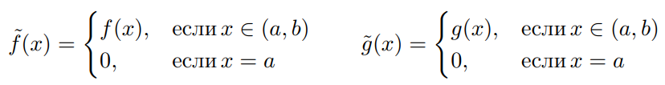

# Решения билетов для комиссии

## Билет 1
---

1. $arcsin(x^2 - 1)$ = $\dfrac{1}{\sqrt{1-(x^2-1)}} * 2x$ = $\dfrac{2x}{\sqrt{2x^2-x^4}}$

2. $\lim\limits_{x \to \infty}{(1 - \dfrac{5}{x - 3})^{2x-1}}$ = $\lim\limits_{x \to \infty}{(1 + \dfrac{-5}{x - 3})^{{\dfrac{x - 3}{-5}} * \dfrac{-5}{x - 3} * {(2x-1)}}}$ = $\lim\limits_{x \to \infty}{e^{\dfrac{-10x + 5}{x - 3}}}$ = $e^{-10}$ = $\dfrac{1}{e^{10}}$

3. Что такое непрерывная и диффренцируемая функция:
    1. В точке:
            
        >Пусть функция $f$ определена в некоторой окрестности точки а. Если существует конечный предел $f′(a) = \lim\limits_{t \to 0}{\dfrac{f(a+t) - f(a)}{t}} = \lim\limits_{x \to a}{\dfrac{f(x) - f(a)}{x - a}} \in R$, то он называется производной функции $f$ в точке a, а про функцию $f$ говорят, что она дифференцируема в точке а
    
    2. На множестве:

        >Функция $f$ называется дифференцируемой на множестве $E$, если она определена вокрестности каждой точки этого множества и дифференцируема в каждой точке это-го множества: $\forall a \in E$  ㅤ$\exists f'(a) = \lim\limits_{t \to 0}{\dfrac{f(a+t) - f(a)}{t}} \in R$

4. Теорема Ролля:

    >Пусть функция $f$ определена на отрезке $[a;b]$, причем: 
    >+ $f$ непрерывна на отрезке $[a;b]$
    >+ $f$ дифференцируема на интервале $(a;b)$
    >+ $f(a) = f(b)$ 

    >Тогда найдется такая точка $\epsilon \in (a;b)$, что $f'(\epsilon) = 0$

    
    >### *Доказательство:*
    >
    >Поскольку $f$ непрерывна на отрезке $[a;b]$, то по теореме Вейрштрасса имеет $min$ и $max$ на этом отрезке.
    >+ 1. Если $min = max$, то функция $f$ должна быть постоянной, поэтому её производная равна нулю в любой точке $=>$, найдется такая точка $\epsilon \in (a;b)$, что $f'(\epsilon) = 0$
    >+ 2. Если $min \neq max$.ㅤЗаметим что $min$ и $max$ не могут лежать в а и б, иначе $min = f(x_{min}) = f(a) = f(b) = f(x_{max}) => min = max$ - противоречие $=> min \lor max$ лежат в интервале $(a;b)$, значит функция $f$ имеет экстремум на интервале $(a;b)$ $=>$ по теореме Ферма - найдется такая точка $\epsilon \in (a;b)$, что $f'(\epsilon) = 0$

5. Напишите геометрический смысл Ролля:

    >Геометрический смысл теоремы Ролля состоит в том, что на графике функции, удовлетворяющей условиям теоремы Ролля, имеется по крайней мере одна точка, в которой касательная горизонтальна.

6. Приведите пример непрерывной, но не дифференцируемой функции:

    >В точке:
    >+ $f(x) = |x|$
    
    >На множестве:
    >+ Функция Вейрштрасса: $f(x) = \displaystyle\sum_{n=1}^{\infty} a^n * cos(b^n\pi x)$
    >+ Функция Ван-дер-Вардена: $f(x) = \displaystyle\sum_{k=0}^{\infty}u_k (x)$

## Билет 2
---

1. $\left(\dfrac{\ln\left(x^{2}-3\,x+1\right)}{arctg\left(3\,x\right)}\right)' = \left(\dfrac{(\ln(x^2-3x+1))' * arctg{3x} - (arctg{3x})'* \ln(x^2-3x+1)}{arctg^2{3x}}\right) = \left(\dfrac{\frac{(arctg{3x})}{x^2-3x+1} *(x^2-3x+1)' -\frac{\ln(x^2-3x+1)}{9x^2 + 1} * (3x)'}{arctg^2{3x}}\right) = \left(\dfrac{2x-3}{(x^2-3x+1)arctg{3x}} - \dfrac{3\ln(x^2-3x+1)}{(9x^2)arctg^2{3x}}\right)$

2. $\lim\limits_{x \to 0}{e^{1+\dfrac{1}{5x+3}}} = e^1=e$

3. Теорема Лагранжа:
    >Пусть $f$ определена на отрезке $[a;b]$, причем:
    >+ $f$ непрерывна на отрезке $[a;b]$
    >+ $f$ дифференцируема на интервале $(a;b)$
    >
    >Тогда существует такая точка $\epsilon \in (a;b)$, что $f'(\epsilon) = \dfrac{f(b)-f(a)}{b-a}$

4. Теорема Коши:
    >Пусть $f$ и $g$ определены на отрезке $[a;b]$, причем:
    >+ $f$ и $g$ непрерывны на отрезке $[a;b]$
    >+ $f$ и $g$ дифференцируемы на интервале $(a;b)$
    >+ $g(x) \neq 0$ при $x \in (a; b)$
    >
    >Тогда существует такая точка $\epsilon \in (a;b)$, что $\dfrac{f'(\epsilon)}{g'(\epsilon)} = \dfrac{f(b)-f(a)}{g(b)-g(a)}$

    >### *Доказательство:*
    >
    >$f(a) \neq f(b)$ по 3 пункту. Тогда возьмем вспомогательную функцию: $F(x) = f(x)-f(a)-\dfrac{f(b)-f(a)}{g(b)-g(a)}(g(x)-g(a))$
    >
    >$F(x)$ удовлетворяет всем условиям теоремы Ролля:
    >+ $F(x)$ непрерывна на отрезке $[a;b]$
    >+ $F(x)$ дифференцируема на интервале $(a;b)$
    >+ $F(a) = F(b)$
    >
    >Значит по теореме Ролля найдется такая точка $\epsilon \in (a;b)$, что $F'(\epsilon) = 0$
    >
    >Тогда: $0 = F'(\epsilon) = f'(\epsilon)-0-\dfrac{f(b)-f(a)}{g(b)-g(a)}*g'(\epsilon) => \dfrac{f'(\epsilon)}{g'(\epsilon)} = \dfrac{f(b)-f(a)}{g(b)-g(a)}$

## Билет 3
---

1. $arctg^{-2}{2x} = \left(\dfrac{1}{arctg^2{2x}}\right) = -\dfrac{(arctg^2{2x})'}{arctg^4{2x}} = -\dfrac{2 arctg{2x}(arctg{2x})'}{arctg^4{2x}} = -\dfrac{2 arctg{2x} * \frac{1}{4x^2+1}*(2x)'}{arctg^4{2x}} = -\dfrac{\frac{4arctg{2x}}{4x^2+1}}{arctg^4{2x}} = -\dfrac{4}{\left(4\,{x}^{2}+1\right)\,arctg^{3}\left(2\,x\right)}$

2. $\lim\limits_{x \to 0}{\dfrac{arctg{5x}-\arcsin{4x}}{e^{3x}-1}} = \lim\limits_{x \to 0}{\dfrac{5x-4x}{3x}} = \dfrac{1}{3}$

3. Правило Лопиталя:
    >Пусть $f$ и $g$ обладают свойствами:
    >+ $f$ и $g$ определены и дифференцируемы в окрестности точки а
    >+ $\lim\limits_{x \to a}{f(x)} = \lim\limits_{x \to a}{g(x)} = 0$
    >+ $g'(x) \neq 0$ при $x \neq a$
    >+ существует предел $\lim\limits_{x \to a}{\dfrac{f'(x)}{g'(x)}}$
    >
    >Тогда существует предел $\lim\limits_{x \to a}{\dfrac{f(x)}{g(x)}}$, причем $\lim\limits_{x \to a}{\dfrac{f(x)}{g(x)}} = \lim\limits_{x \to a}{\dfrac{f'(x)}{g'(x)}}$

    >### *Доказательство:*
    >
    >Возьмем произвольную последовательность $x_n$, $\lim\limits_{n \to \infty}{x_n} = 0$, $x_n \neq a$
    >
    >Доопределим $f$ и $g$ в точке а: 
    >
    >
    >
    >Тогда на каждом отрезке $[a; x_n], (a < x_n)$ функции $\tilde{f}$ и $\tilde{g}$ удовлетворяют условиям теоремы Коши:
    >+ $\tilde{f}$ и $\tilde{g}$ определены на $[a; x_n]$
    >+ $\tilde{f}$ и $\tilde{g}$ дифференцируемы на $(a; x_n)$
    >+ $g'(x) \neq 0$ при $x \in (a; x_n)$
    >
    >Значит по теореме Коши существует точка $\epsilon_n$, такая что
    >+ $\dfrac{\tilde{f}(x_n) - \tilde{f}(a)}{\tilde{g}(x_n) - \tilde{g}(a)} = \dfrac{f'(\epsilon_n)}{g'(\epsilon_n)}$
    >
    >Но так как у нас $\tilde{f}(a) = \tilde{g}(a) = 0$, получается:
    >+ $\dfrac{\tilde{f}(x_n)}{\tilde{g}(x_n)} = \dfrac{f'(\epsilon_n)}{g'(\epsilon_n)}, \epsilon_n \in (a; x_n)$
    >
    >Теперь устремим n к бесконечности:
    >+ $\lim\limits_{n \to \infty}{\dfrac{f(x_n)}{g(x_n)}} = \lim\limits_{n \to \infty}{\dfrac{\tilde{f}(x_n)}{\tilde{g}(x_n)}} = \lim\limits_{n \to \infty}{\dfrac{f'(\epsilon_n)}{g'(\epsilon_n)}} = \lim\limits_{\epsilon \to a}{\dfrac{f'(\epsilon)}{g'(\epsilon)}} = \lim\limits_{x \to a}{\dfrac{f'(x)}{g'(x)}}$
    >
    >Как раз это нам и нужно было проверить.

4. Виды неопределённостей:
    >Неопределенности сущесвтуют следующих видов:
    >+ $\dfrac{0}{0}$
    >+ $\dfrac{\infty}{\infty}$
    >+ $0 * \infty$
    >+ $\infty - \infty$
    >+ $0^0$
    >+ $1^{\infty}$
    >+ $\infty^0$

5. Теорема о первом замечательном пределе:
    >$\lim\limits_{x \to 0}{\dfrac{\sin(x)}{x}} = 1$
    >
    >Это равенство называется *Первым замечательным пределом*

## Билет 4
---

1. Производная от деления:
    >Так как производную никто не запомнил, напишу формулы:
    >+ $(\dfrac{1}{u})' = -\dfrac{u'}{u^2}$
    >+ $(\dfrac{u}{v})' = \dfrac{u'v - v'u}{v^2}$
